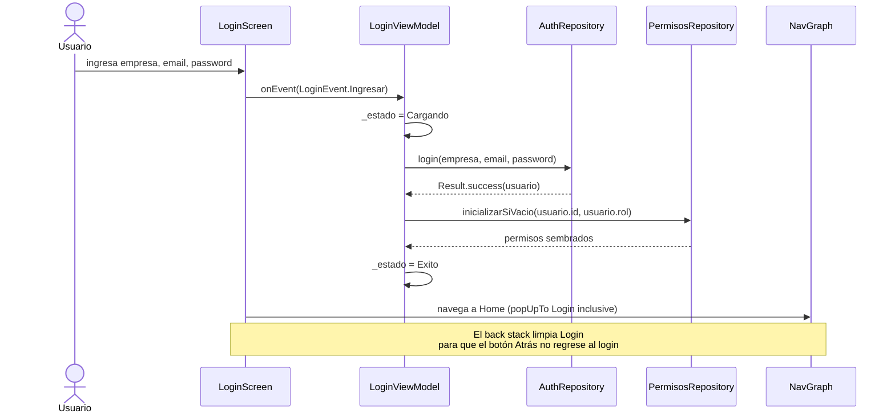
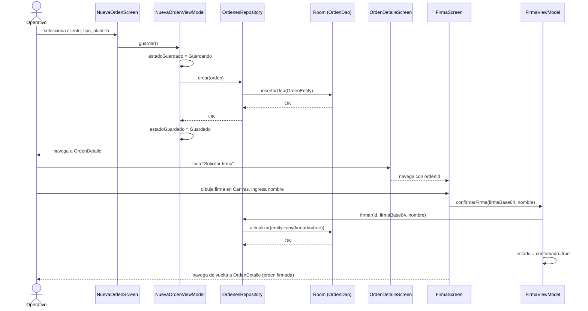
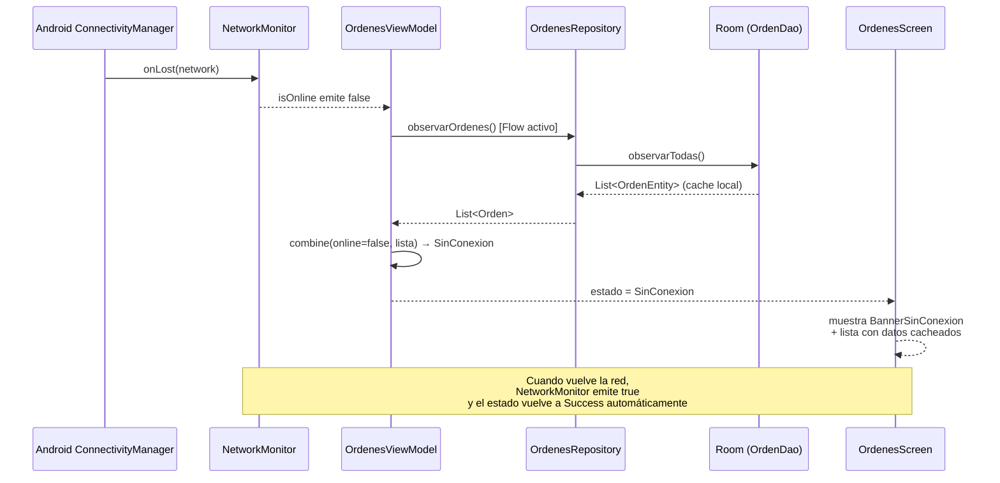
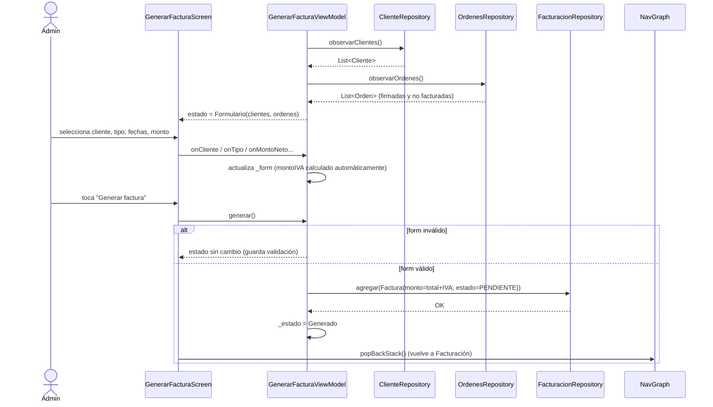
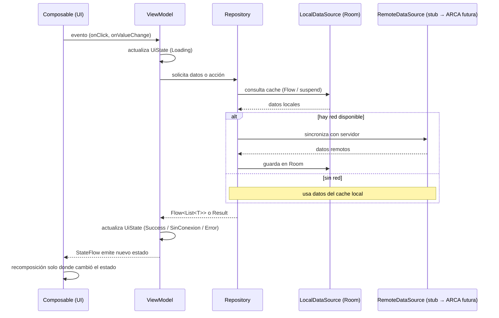

# Diagramas de Secuencia — ElevaPro

> Flujos principales del TP Integrador H2. Cada diagrama muestra la interacción entre capas siguiendo el patrón MVVM + Repository + UDF.

---

## 1. Autenticación (Login)

Flujo: el usuario ingresa sus credenciales → `LoginViewModel` delega al `AuthRepository` → se inicializan los permisos del rol → navegación al Home.

---

## 2. Crear y Firmar una Orden de Trabajo

Flujo completo de trabajo: crear orden → cargar detalle → firmar con Canvas → orden marcada como firmada en Room.

---

## 3. Modo Offline — Detección y Estado Sin Conexión

Flujo: la red se pierde → `NetworkMonitor` emite `false` → `OrdenesViewModel` emite `SinConexion` → UI muestra banner sin bloquear datos cacheados.

---

## 4. Generar Factura Electrónica

Flujo: el Administrador completa el formulario → `GenerarFacturaViewModel` valida → crea la `Factura` en el `FacturacionRepository` → estado `Generado` → navegación de vuelta.

---

## 5. Arquitectura de Capas — Diagrama General

Vista estática de cómo se relacionan las capas en ElevaPro.

---

## Resumen de flujos cubiertos

| # | Flujo | Capas involucradas |
|---|---|---|
| 1 | Login + inicialización de permisos | UI → VM → AuthRepo + PermisosRepo → NavGraph |
| 2 | Crear orden + firma con Canvas | UI → VM → OrdenesRepo → Room → VM → UI |
| 3 | Modo offline con datos cacheados | ConnectivityManager → NetworkMonitor → VM → Room → UI |
| 4 | Generar factura con validación de IVA | UI → VM → ClienteRepo + OrdenesRepo + FacturacionRepo → UI |
| 5 | Arquitectura general de capas | UI ↔ VM ↔ Repo ↔ Local / Remote |
